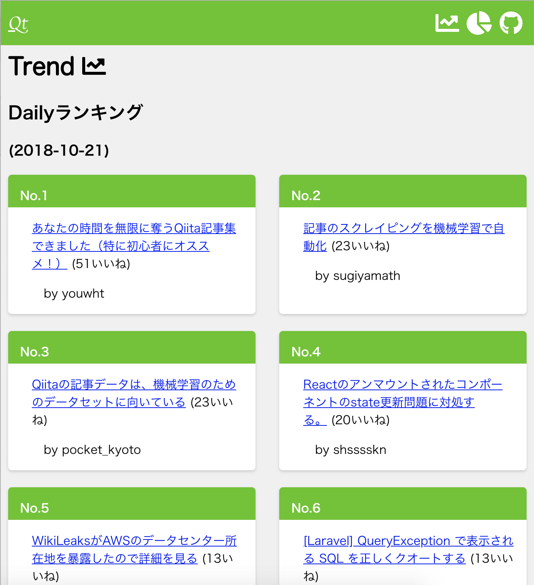
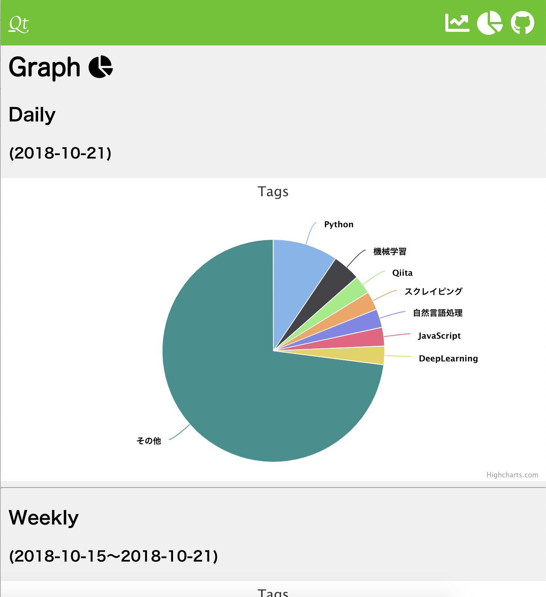
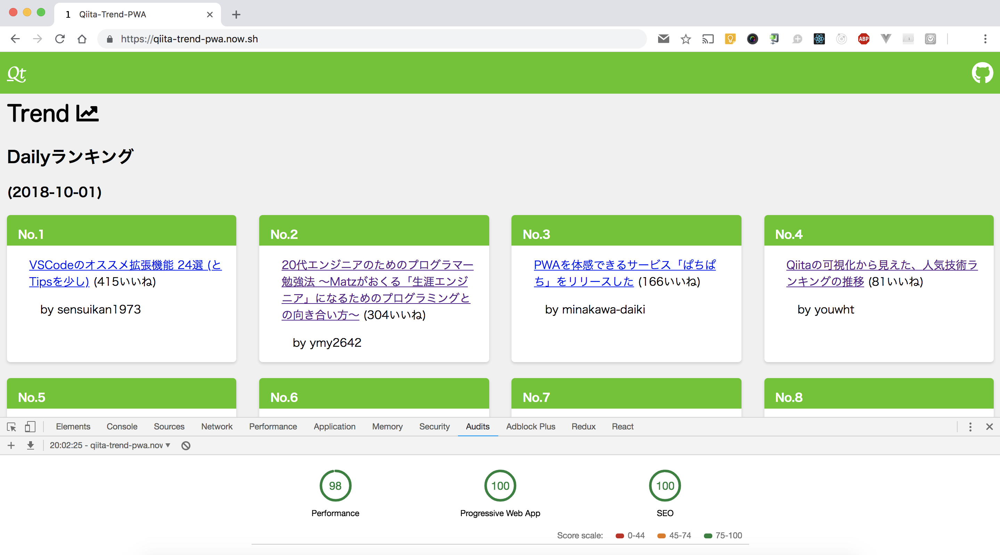

# qiita-trend-pwa

[](https://github.com/ebidel/lighthouse-badge)
[](https://github.com/ebidel/lighthouse-badge)
[](https://github.com/ebidel/lighthouse-badge)

[Qiita-Trend-PWA](https://qiita-trend-pwa.now.sh/)<br>
PWA を適用した Qiita のいいねランキング集計サイト。<br>



# Feature



- Progressive web app
  - offline
  - install prompts on supported platforms
- Server Side Rendering
- Next.js

# Contents

主に以下 2 つのランキングを掲載している。内容は 2 時間毎に最新化される。

- デイリーいいねランキング(前日投稿分のランキング)
- ウィークリーいいねランキング(直近 1 週間投稿分のランキング)

これらは[qiita-scraiping](https://github.com/zonbitamago/qiita-scraiping)の内容を取得し、表示している。

# Setting the project up locally

```
$ git clone https://github.com/zonbitamago/qiita-trend-pwa.git
$ cd qiita-trend-pwa.git
$ npm install
$ npm run dev
```

# Testing

Using[BrowserStack.com](https://www.browserstack.com)<br><br>


# Licence

This software is released under the MIT License, see LICENSE.

# Authors

[zonbitamago](https://github.com/zonbitamago)

# References

[trends](https://github.com/hanford/trends)<br>
[qiita-scraiping](https://github.com/zonbitamago/qiita-scraiping)<br>
[BrowserStack.com](https://www.browserstack.com)
